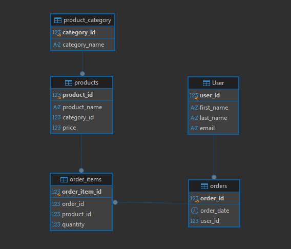

# Отчет по проектированию базы данных «Онлайн-магазин электроники»

## Part 1. Выбор сценария
Для данной работы был выбран сценарий: **Онлайн-магазин электроники**. Эта система будет управлять категориями товаров, товарами, покупателями и оформленными заказами.

---

## Part 2. Проектирование Базы Данных и Документация

### Идентификация Сущностей и Атрибутов:
* Категории товаров (`product_category`);
* Товары (`products`);
* Покупатели (`User`);
* Заказы (`orders`);
* Содержимое заказов (`order_items`).

### Проектирование Таблиц:

#### Table Name: `product_category`
* **Description:** Содержит информацию о категориях товаров.
* **Attributes:**
  * `category_id`: INTEGER, PK
  * `category_name`: VARCHAR(50), NOT NULL
* **Constraints:**
  * `product_category_pk`: PRIMARY KEY (`category_id`)
  * `product_category_unique`: UNIQUE (`category_name`)

#### Table Name: `products`
* **Description:** Содержит информацию о товарах.
* **Attributes:**
  * `product_id`: INTEGER, PK
  * `product_name`: VARCHAR(255), NOT NULL
  * `category_id`: INTEGER, FK (REFERENCES `product_category`), NOT NULL
  * `price`: NUMERIC(10, 2), NOT NULL
* **Constraints:**
  * `products_pk`: PRIMARY KEY (`product_id`)
  * `products_check`: CHECK (`price` > 0)
  * `products_product_category_fk`: FOREIGN KEY (`category_id`) REFERENCES `product_category`(`category_id`)

#### Table Name: `User`
* **Description:** Содержит информацию о пользователях.
* **Attributes:** 
  * `user_id`: INTEGER, PK
  * `first_name`: VARCHAR(100), NOT NULL
  * `last_name`: VARCHAR(100), NOT NULL
  * `email`: VARCHAR(255), NOT NULL, UNIQUE
* **Constraints:**
  * `user_pk`: PRIMARY KEY (`user_id`)
  * `user_unique`: UNIQUE (`email`)

#### Table Name: `orders`
* **Description:** Содержит информацию о заказах.
* **Attributes:** 
  * `order_id`: INTEGER, PK
  * `order_date`: DATE, NOT NULL
  * `user_id`: INTEGER, FK (REFERENCES `User`)
* **Constraints:**
  * `orders_pk`: PRIMARY KEY (`order_id`)
  * `orders_check`: CHECK (`order_date` <= CURRENT_TIMESTAMP)
  * `order_user_fk`: FOREIGN KEY (`user_id`) REFERENCES `User` (`user_id`)

#### Table Name: `order_items`
* **Description:** Содержит информацию о товарах в заказе (реализует связь M:M).
* **Attributes:**
  * `order_item_id`: INTEGER, PK
  * `order_id`: INTEGER, FK (REFERENCES `orders`)
  * `product_id`: INTEGER, FK (REFERENCES `products`)
  * `quantity`: INTEGER, NOT NULL
* **Constraints:**
  * `order_items_pk`: PRIMARY KEY (`order_item_id`)
  * `order_items_orders_fk`: FOREIGN KEY (`order_id`) REFERENCES `orders` (`order_id`)
  * `order_items_products_fk`: FOREIGN KEY (`product_id`) REFERENCES `products` (`product_id`)

### Взаимосвязи:
* **`product_category` и `products` (Один-ко-Многим):** Одной категории может принадлежать множество товаров, но каждый товар можно отнести только к одной категории. `products.category_id` является внешним ключом, ссылающимся на `product_category.category_id`.
* **`User` и `orders` (Один-ко-Многим):** Один покупатель может сделать множество заказов, но каждый заказ будет относиться к определённому покупателю. `orders.user_id` является внешним ключом, ссылающимся на `User.user_id`.
* **`orders` и `products` (Многие-ко-Многим):** Один заказ может содержать множество различных товаров, и в то же время один и тот же товар может находиться в разных заказах множества покупателей. Связь канонично декомпозирована с помощью таблицы-моста `order_items`.
  * `order_items.order_id` является внешним ключом, ссылающимся на `orders.order_id`.
  * `order_items.product_id` является внешним ключом, ссылающимся на `products.product_id`.

---

## Part 3: ER-Диаграмма

---

## Part 4: Описание бизнес-логики

Система полностью автоматизирует основные бизнес-процессы электронной коммерции. Она создает масштабируемую и нормализованную реляционную базу данных для комплексного управления продажами и автоматизации обработки клиентских заказов.

### Основные характеристики и возможности:
* **Управление структурой каталога (Систематизация товаров);**
* **Ведение клиентской базы (Регистрация и идентификация пользователей в системе);**
* **Автоматизация продаж (Многопозиционные заказы):.**