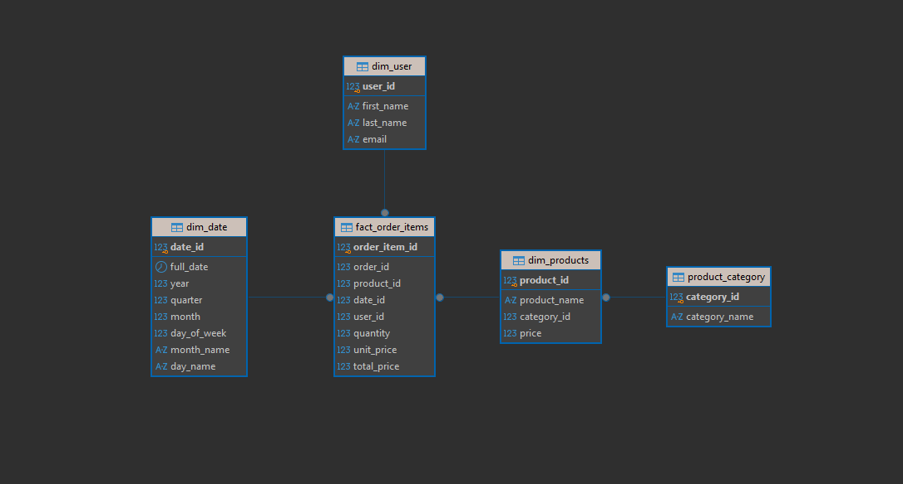

# Homework 5

## 1. Selected Business Process & Data Grain
* **Business Process:** **Online Electronics Store Sales**.
* **Data Grain (Level of Detail):** **One row in the fact table corresponds to an atomic line item within an order**. This ensures high granularity for evaluating specific product sales, exact transaction timestamps, and individual buyer behavior.

## 2. Dimensional Model Architecture (Snowflake Schema)
The architecture is structured as a **Snowflake Schema**, which normalizes dimensional branches.
* **`fact_order_items` (Fact Table):** The core analytical table storing quantitative business events, transaction foreign keys (`product_id`, `date_id`, `user_id`), and computed financial parameters.
* **`dim_products` (Dimension Table):** Represents specific store merchandise and acts as a bridge to normalization.
* **`product_category` (Snowflake Sub-Dimension):** Normalizes categories out of the product table, transforming the model into a Snowflake structure.
* **`dim_user` (Dimension Table):** Contains structural parameters defining corporate customers or individual store buyers.
* **`dim_date` (Dimension Table):** A comprehensive time dimension breaking down physical calendar metrics into quarters, specific months, and weekdays for deep time-series analysis.

---

## 3. SQL Data Definition Language (DDL) Script
```sql
-- 1. Create snowflake dimension
CREATE TABLE product_category (
    category_id INT PRIMARY KEY,
    category_name VARCHAR(255) NOT NULL UNIQUE 
);

-- 2. Create products dimension
CREATE TABLE dim_products (
    product_id INT PRIMARY KEY,
    product_name VARCHAR(255) NOT NULL,
    category_id INT NOT NULL,
    price DECIMAL(10, 2) NOT NULL,
    FOREIGN KEY (category_id) REFERENCES product_category(category_id)
);

-- 3. Create user dimension
CREATE TABLE dim_user (
    user_id INT PRIMARY KEY,
    first_name VARCHAR(100) NOT NULL,
    last_name VARCHAR(100) NOT NULL,
    email VARCHAR(255) UNIQUE NOT NULL
);

-- 4. Create date dimension
-- Add column year, quarter, month, day_of_week, month_name, and day_name for analytics
CREATE TABLE dim_date (
    date_id INT PRIMARY KEY,
    full_date DATE NOT NULL UNIQUE, 
    -- Add UNIQUE constraint on full_date to prevent duplicate date entries
    -- One date_id can be reused across many fact records
    year INT NOT NULL,
    quarter INT NOT NULL CHECK (quarter BETWEEN 1 AND 4),
    month INT NOT NULL CHECK (month BETWEEN 1 AND 12),
    day_of_week INT NOT NULL CHECK (day_of_week BETWEEN 1 AND 7),
    month_name VARCHAR(20),
    day_name VARCHAR(20)
);

-- 5. Create fact table - business action (purchase, transaction)
CREATE TABLE fact_order_items (
    order_item_id INT PRIMARY KEY,
    order_id INT NOT NULL,
    product_id INT NOT NULL,
    date_id INT NOT NULL,
    user_id INT NOT NULL,
    quantity INT NOT NULL CHECK (quantity > 0),
    unit_price DECIMAL(10, 2) NOT NULL,
    total_price DECIMAL(10, 2) GENERATED ALWAYS AS (quantity * unit_price) STORED, -- Added a calculation of the total cost
    FOREIGN KEY (product_id) REFERENCES dim_products(product_id),
    FOREIGN KEY (date_id) REFERENCES dim_date(date_id),
    FOREIGN KEY (user_id) REFERENCES dim_user(user_id)
);
```

---

## 4. Business Analytical SQL Queries

### Query 1: Top-5 Best-Selling Products in Each Category
Evaluates performance metrics within distinct groupings utilizing window functions to ranking category drivers.
```sql
-- Top-5 best-selling products in each category
SELECT 
    dp.product_name,
    pc.category_name,
    SUM(foi.quantity) AS units_sold,
    SUM(foi.total_price) AS revenue,
    ROW_NUMBER() OVER (PARTITION BY pc.category_name ORDER BY SUM(foi.total_price) DESC) AS category_rank -- Add Window Function
FROM fact_order_items foi
JOIN dim_products dp 
	ON foi.product_id = dp.product_id
JOIN product_category pc 
	ON dp.category_id = pc.category_id
GROUP BY dp.product_name, pc.category_name;
```

### Query 2: Daily Sales Dynamics (Revenue vs Volume Trajectories)
Identifies high-performing operational loops (promotions, holidays, corporate shifts) through dual tracking configurations.
```sql
-- We can see on which days the store generated the highest profit (for example, during holidays or sales)
SELECT 
    dd.full_date AS Date,
    SUM(foi.total_price)
FROM fact_order_items foi
JOIN dim_date dd 
	ON foi.date_id = dd.date_id
GROUP BY dd.full_date
ORDER BY SUM(foi.total_price) DESC;

-- Or the highest sales volume
SELECT 
    dd.full_date AS Date,
    SUM(foi.quantity)
FROM fact_order_items foi
JOIN dim_date dd 
	ON foi.date_id = dd.date_id
GROUP BY dd.full_date
ORDER BY SUM(foi.quantity) DESC;
```

### Query 3: Top Corporate/Retail Customers Identification
Isolates critical target shoppers to drive customer loyalty strategies and targeted marketing loops.
```sql
-- We can view the top customers of our store (honestly, I don't think this is practical for a large store, but the capability exists).
SELECT 
    du.first_name,
    du.last_name,
    du.user_id,
    SUM(foi.total_price)
FROM fact_order_items foi
JOIN dim_user du 
	ON foi.user_id = du.user_id
GROUP BY du.user_id 
ORDER BY SUM(foi.total_price) DESC
LIMIT 10;
```

### Query 4: Core Category Profitability Matrices
Evaluates holistic operational trajectories by tracing gross margins and bulk volume rankings across the catalog.
```sql
-- To see which category is the most profitable (or if sorting by total_units_sold the best-selling)
SELECT 
    pc.category_name,
    SUM(foi.quantity) AS total_units_sold,
    SUM(foi.total_price) AS total_revenue
FROM fact_order_items foi
JOIN dim_products dp 
	ON foi.product_id = dp.product_id
JOIN product_category pc 
	ON dp.category_id = pc.category_id
GROUP BY pc.category_name
ORDER BY total_revenue DESC;
```

---

## 5. ER-diagram


